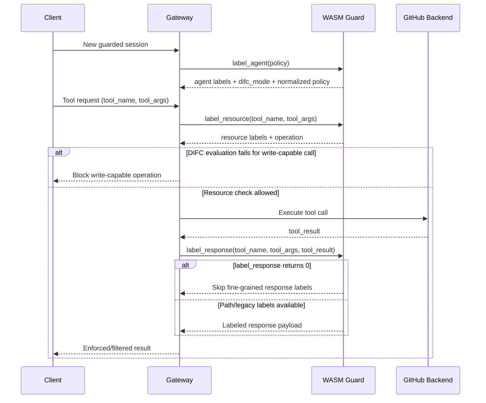

# GitHub Guard for MCP Gateway

A Rust-based WASM security guard implementing DIFC (Decentralized Information Flow Control) for GitHub MCP servers.

## Overview

The GitHub Guard labels all GitHub operations and data for the MCP Gateway reference monitor. The guard runs as a sandboxed WebAssembly module loaded by the MCP Gateway.

The MCP Gateway's Decentralized Information Flow Control (DIFC) relies on two types of labels to enforce security policies:

### Secrecy (Confidentiality)
- **Rule**: Data can only be consumed by agents with *equal or higher* secrecy clearance
- **Effect**: Prevents private data from leaking to unauthorized agents
- **Example**: A response labeled `private:org/repo` can only be read by agents with `private:org/repo` clearance in their secrecy label

### Integrity (Trust)
- **Rule**: Agents can only trust data with *the same or greater* endorsement than their own
- **Effect**: Prevents untrusted data from influencing high-integrity operations
- **Example**: An agent with ``unapproved:org/repo`` integrity will reject data with only ∅ (empty) integrity

### Combined Effect

| Agent Labels | Data/Resource Labels | Can Read? | Can Write? | Reason |
|--------------|----------------------|-----------|------------|--------|
| Secrecy: `[]`, Integrity: `[approved:X, unapproved:X]` | Secrecy: `[]`, Integrity: `[approved:X, unapproved:X]` | ✅ Yes | ✅ Yes | Labels match |
| Secrecy: `[private:X]`, Integrity: `[approved:X, unapproved:X]` | Secrecy: `[private:X]`, Integrity: `[approved:X, unapproved:X]` | ✅ Yes | ✅ Yes | Agent has full clearance |
| Secrecy: `[]`, Integrity: `[approved:X, unapproved:X]` | Secrecy: `[private:X]`, Integrity: `[approved:X, unapproved:X]` | ❌ No | ✅ Yes | Read blocked (no clearance), write OK (no secrets to leak) |
| Secrecy: `[private:X]`, Integrity: `[approved:X, unapproved:X]` | Secrecy: `[]`, Integrity: `[]` | ❌ No | ❌ No | Read blocked (low integrity), write blocked (would leak secrets) |
| Secrecy: `[]`, Integrity: `[]` | Secrecy: `[]`, Integrity: `[approved:X, unapproved:X]` | ✅ Yes | ❌ No | Read OK, write blocked (agent integrity too low) |
| Secrecy: `[private:X]`, Integrity: `[unapproved:X]` | Secrecy: `[]`, Integrity: `[approved:X, unapproved:X]` | ✅ Yes | ❌ No | Read OK, write blocked (would leak private data AND integrity too low) |

> **Read rule**: Agent secrecy ⊇ data secrecy AND agent integrity ⊆ data integrity  
> **Write rule**: Agent secrecy ⊆ resource secrecy AND agent integrity ⊇ resource required integrity

## Guard Interface and Call Flow

The guard exposes three WASM entrypoints used by the gateway:

- `label_agent`
   - Purpose: initialize the agent/session labels from policy input.
   - Input: session policy (`allow-only` payload).
   - Output: agent secrecy/integrity labels, `difc_mode`, and normalized policy metadata.

- `label_resource`
   - Purpose: label a tool invocation before execution.
   - Input: `tool_name` + `tool_args`.
   - Output: resource labels (`description`, `secrecy`, `integrity`) and operation type (`read`, `write`, `read-write`).
   - Enforcement role: the operation type determines which DIFC flow rule is evaluated between agent labels and resource labels before write-capable execution.
   - Assumption: `read` operations are treated as side-effect-free, so they are safe to execute and then forward to `label_response`.

- `label_response`
   - Purpose: label tool results after backend execution.
   - Input: `tool_name`, `tool_args`, `tool_result`.
   - Output: fine-grained labels (preferred path-based format), or legacy item-labeled output for singleton/fallback cases.

### Gateway sequencing

For a guarded request, the effective flow is:

1. **Session init**: call `label_agent` once to establish session labels/policy context.
2. **Before tool execution**: call `label_resource` for the requested tool.
3. **Operation-aware DIFC evaluation** (from `label_resource.operation`):
   - `read`: execute the backend call (read-only calls are side-effect-free).
   - `write`: evaluate write flow rule using agent + resource labels before backend execution.
   - `read-write`: evaluate required rules for write-capable operations using agent + resource labels.
4. **Apply evaluation result**:
   - if write-capable DIFC rule evaluation fails, backend execution is skipped and `label_response` is not called.
   - otherwise, gateway executes the backend tool call.
5. **After tool execution**: call `label_response` to attach result labels for the returned payload.
6. **Final enforcement/filtering**: gateway applies DIFC checks/filters using session + resource/response labels.



### Rule evaluation and fallback behavior

- **Operation-driven evaluation**: `label_resource.operation` determines which DIFC rule(s) are evaluated from agent + resource labels.
- **Write-capable enforcement**: if DIFC evaluation fails for `write`/`read-write`, backend invocation is skipped and `label_response` is not called.
- **Read-only execution**: `read` calls execute and their results are forwarded to `label_response`.
- **Response-stage short-circuit**: when `label_response` returns `0`, the guard is signaling “skip fine-grained labeling” (for example, parse/serialization/buffer issues), and the gateway continues without path/item-level response labels.
- **Guard fallback inside `label_response`**: when path-based labeling is not available, the guard falls back to legacy item labeling and can create a single-item fallback label so singleton responses are still labeled.

### How AllowOnly Policies Create Operating Modes

The guard's behavior in this repository is controlled by **AllowOnly policy** payloads passed via `MCP_GATEWAY_GUARD_POLICY_JSON`.

| Mode | AllowOnly Policy | Effect |
|------|------------------|--------|
| **YOLO** | N/A (no guard) | No protection - all data flows freely |
| **Public-Only** | `{"allow-only":{"repos":"public","min-integrity": "none"}}` | Public-safe filtering with lowest integrity floor |
| **Owner-Only** | `{"allow-only":{"repos":["<owner>/*"],"min-integrity": "none"}}` | Owner-scoped filtering |
| **Repo-Only** | `{"allow-only":{"repos":["<owner>/<repo>"],"min-integrity": "none"}}` | Repo-scoped filtering pinned to one repo |

**YOLO Mode**: The guard is not loaded. No labels are checked.

**Public-Only Mode**:
- ✅ Public data remains accessible
- ❌ Private data is filtered/blocked
- ✅ Integrity floor is `None`

**Owner-Only Mode**:
- ✅ Data in owner scope can be accessed when labels satisfy policy
- ❌ Data outside owner scope is blocked/filtered
- ✅ Integrity floor is `none` (runner default)

**Repo-Only Mode**:
- ✅ Data in scoped repo can be accessed when labels satisfy policy
- ❌ Data outside scoped repo is blocked/filtered
- ✅ Scope is pinned by `DIFC_SCOPE` (default `lpcox/github-guard`)

### difc_mode values

`label_agent` returns `difc_mode`, which tells the gateway how to enforce labels:

- `filter`: enforce by filtering/removing disallowed data while preserving allowed portions of the response.
- `strict`: enforce as hard deny when checks fail (no partial filtered success).
- `propagate`: preserve and forward labels for downstream DIFC handling rather than applying this guard's filtering behavior.

In this repository's operating modes, **AllowOnly policies use `filter` mode**.

### Features

- ✅ **Complete GitHub MCP Coverage**: Handles all GitHub MCP server tools
- ✅ **DIFC Enforcement**: Implements integrity and secrecy flow control  
- ✅ **Fine-grained Labeling**: Labels individual items in collection responses
- ✅ **Backend Integration**: Calls GitHub APIs to verify contributor status
- ✅ **Sensitive Content Detection**: Identifies secrets and security issues
- ✅ **WASM Sandboxing**: Runs as an isolated WebAssembly module (~170KB)

## DIFC Labeling

The guard applies security labels to all GitHub data:

### Secrecy Labels

| Repository Type | Secrecy Label |
|-----------------|---------------|
| Public repo | `[]` (empty - anyone can read) |
| Private repo | `["private:<owner>/<repo>"]` |

### Integrity Labels

Integrity labels are hierarchical: `merged > approved > unapproved > none`

| Object Type | Condition | Integrity |
|-------------|-----------|-----------|
| **Repository metadata** | Always | `approved + unapproved` |
| **Commits** | On default branch | `merged + approved + unapproved` |
| **Commits** | On feature branch | `unapproved` (or elevated by policy evidence) |
| **Pull Requests** | Merged | `merged + approved + unapproved` |
| **Pull Requests** | Open/unmerged (human) | `unapproved` (or elevated by policy evidence) |
| **Pull Requests** | From bots | `approved + unapproved` |
| **Issues/Comments** | From repo owner | `approved + unapproved` |
| **Issues/Comments** | From bots | `approved + unapproved` |
| **Issues/Comments** | From verified contributor | `unapproved` |
| **Issues/Comments** | From unknown author | `[]` (untrusted) |
| **Security alerts** | Code/Dependabot scanning | `approved + unapproved` |
| **Secret scanning** | Alerts reference secrets | `approved + unapproved`, secrecy: `secret` |

> **Note**: A "verified contributor" is a user with at least one merged PR in the repository. The guard queries the GitHub API to check this at runtime.

For detailed labeling rules, see [docs/LABELING.md](./docs/LABELING.md).

## Operating Modes

See [How AllowOnly Policies Create Operating Modes](#how-allow-only-policies-create-operating-modes) above for how these work.

| Mode | Use Case | Recommended For |
|------|----------|-----------------|
| **YOLO** | Development without security overhead | Local development, debugging |
| **Public-Only** | Prevent private data leakage | Open source work, public data analysis |
| **Owner-Only** | Owner-scoped filtering | Owner-wide protected workflows |
| **Repo-Only** | Repo-scoped filtering pinned to one repository | Scoped private repo testing and guarded automation |

**Configuration**: Set `DIFC_SCOPE` environment variable to specify the scoped repository (default: `lpcox/github-guard`). This applies to `repo-only` mode.

## Quick Start

### Prerequisites

1. **Rust** (latest stable)
   ```bash
   curl --proto '=https' --tlsv1.2 -sSf https://sh.rustup.rs | sh
   ```

2. **WASI target**
   ```bash
   rustup target add wasm32-wasip1
   ```

### Building

```bash
# Build the WASM module
make build

# Run default test pipeline
make test

# See all available targets
make help
```

This produces `github-guard-rust.wasm` (~170KB), ready to be loaded by the MCP Gateway.

## Documentation

- **[Main Documentation](./docs/OVERVIEW.md)** - Complete overview, features, and usage guide
- **[Labeling Specification](./docs/LABELING.md)** - How DIFC labels are applied
- **[Quick Start Guide](./docs/QUICKSTART.md)** - Get started quickly
- **[Testing Guide](./docs/TESTING.md)** - Information about tests and coverage
- **[Implementation Details](./docs/IMPLEMENTATION.md)** - Technical implementation details
- **[Security Summary](./docs/SECURITY_SUMMARY.md)** - Security analysis and findings

## Makefile Targets

| Target | Description |
|--------|-------------|
| `make` or `make all` | Build WASM module and run tests |
| `make build` | Build the Rust WASM module |
| `make test` | Run default pipeline (build, unit, wasm, integration, integrity) |
| `make test-all` | Run default pipeline plus Copilot test |
| `make test-unit` | Run Rust unit tests only |
| `make test-wasm` | Verify WASM build |
| `make test-integration` | Run integration tests (requires Docker + `.env`) |
| `make test-integrity-harness` | Run corpus-driven WASM integrity harness tests |
| `make capture-integrity-corpus` | Refresh integrity corpus fixture from live OSS repos |
| `make test-copilot` | Run Copilot CLI in yolo mode (default) |
| `make test-copilot-yolo` | Run Copilot CLI with no guard (development) |
| `make test-copilot-public-only` | Run Copilot CLI filtering private data (public repos only) |
| `make test-copilot-owner-only` | Run Copilot CLI in owner-scoped mode (`ALLOW_OWNER`, default `lpcox`) |
| `make test-copilot-repo-only` | Run Copilot CLI in repo-scoped mode (`DIFC_SCOPE`) |
| `make clean` | Remove build artifacts |
| `make release patch|minor|major` | Create and push a release tag |
| `make help` | Show help message |

## Integration Tests

Integration tests use Docker containers to test the guard with the MCP Gateway:

```bash
# Create .env file with your GitHub token (never commit this!)
echo 'GITHUB_TOKEN=ghp_your_token_here' > .env

# Run integration tests
make test-integration
```

## Repository Structure

```
github-guard/
├── rust-guard/             # Rust WASM implementation
│   ├── src/
│   │   ├── lib.rs         # Main entry point, exports
│   │   ├── labels/        # DIFC label generation (refactored module)
│   │   │   ├── mod.rs           # Module exports
│   │   │   ├── constants.rs     # Label constants and limits
│   │   │   ├── helpers.rs       # Label creation helpers
│   │   │   ├── backend.rs       # Backend API calls
│   │   │   ├── tool_rules.rs    # Tool-specific labeling rules
│   │   │   ├── response_paths.rs # Path-based response labeling
│   │   │   ├── response_items.rs # Item-based response labeling
│   │   │   └── README.md        # Module documentation
│   │   ├── tools.rs       # Tool classification
│   │   └── permissions.rs # Permission helpers
│   ├── Cargo.toml
│   └── build.sh
├── docs/                   # Documentation
│   ├── README.md          # Main documentation
│   ├── LABELING.md        # Labeling specification
│   ├── QUICKSTART.md      # Quick start guide
│   └── ...
├── scripts/               # Helper scripts
├── Makefile               # Build and test automation
└── config.example.json    # Configuration example
```

## License

See [LICENSE](./LICENSE) file for details.
