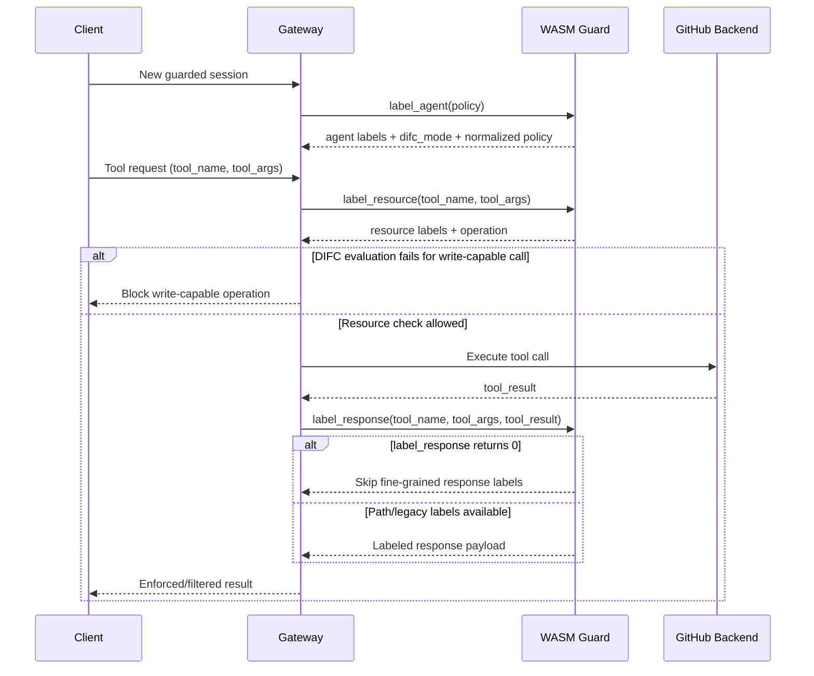

# GitHub Guard for MCP Gateway

A complete WASM-based security guard implementing DIFC (Decentralized Information Flow Control) for GitHub MCP servers. This guard enforces integrity and secrecy labels on GitHub operations, protecting against unauthorized access and data leakage.

## Overview

The GitHub Guard implements a principled DIFC security model for GitHub objects:

- **Integrity Labels**: `merged > approved > unapproved > none`
- **Secrecy Labels**: `public < private < secret`

The guard analyzes GitHub MCP operations and assigns appropriate security labels based on:
- Operation type (read, write, read-write)
- Repository visibility
- Resource sensitivity
- Author contribution history

## Guard Interface and Gateway Call Flow

The guard exposes three WASM entrypoints used by the gateway:

- `label_agent`
  - Initializes session labels from policy input.
  - Returns agent secrecy/integrity labels, `difc_mode`, and normalized policy metadata.

- `label_resource`
  - Labels a tool invocation before backend execution.
  - Returns resource labels (`description`, `secrecy`, `integrity`) and operation type (`read`, `write`, `read-write`).
  - The operation type determines which DIFC flow rule(s) are evaluated between agent labels and resource labels before write-capable execution.
  - Assumption: `read` operations are side-effect-free, so they are considered safe to execute and then pass to `label_response`.

- `label_response`
  - Labels tool output after backend execution.
  - Returns path-based fine-grained labels (preferred) or legacy item-labeled fallback output.

For a guarded request, the gateway sequence is:

1. Call `label_agent` once per session.
2. For each tool call, invoke `label_resource` first.
3. Evaluate operation-aware checks from `label_resource.operation`:
  - `read`: execute backend call.
  - `write`: evaluate write flow rule from agent + resource labels.
  - `read-write`: evaluate required DIFC rules for write-capable operations from agent + resource labels.
4. If write-capable DIFC evaluation fails, skip backend execution and do not call `label_response`.
5. For `read` (and allowed write-capable calls), execute backend tool call and then invoke `label_response` on the returned payload.
6. Apply DIFC enforcement/filtering with session + resource/response labels.



Rule evaluation and fallback semantics:

- `label_resource.operation` selects which DIFC rule(s) are evaluated using agent + resource labels.
- If DIFC evaluation fails for `write`/`read-write`, backend and `label_response` are both skipped.
- `read` calls execute and are forwarded to `label_response`.
- `label_response` returning `0` means skip fine-grained response labeling.
- When path-based labeling is unavailable, the guard falls back to legacy item labeling (including singleton fallback labeling when needed).

## Operating Modes

The Copilot test runner in this repository documents four modes:

### 1. **YOLO Mode** - No Protection
```bash
make test-copilot-yolo
```

- **Security**: Disabled - plain gateway passthrough without guard
- **Integrity Filtering**: None
- **Secrecy Filtering**: None
- **Use Case**: Local development, debugging, testing without security overhead
- **Data Access**: Unrestricted access to all repositories and contributors

### 2. **Public-Only Mode**
```bash
make test-copilot-public-only
```

- **Security**: DIFC filter mode with AllowOnly policy
- **Integrity Filtering**: `allow-only.min-integrity=none`
- **Secrecy Filtering**: Private data is filtered/blocked from responses
- **Use Case**: Public-safe analysis and read-only verification workflows
- **Data Access**: Public repos should remain accessible; private scope should be denied/filtered

**Environment Variables**:
```bash
MCP_GATEWAY_ENABLE_GUARDS=1
MCP_GATEWAY_CONFIG_EXTENSIONS=1
MCP_GATEWAY_GUARD_POLICY_JSON='{"allow-only":{"repos":"public","min-integrity": "none"}}'
```

### 3. **Owner-Only Mode**
```bash
make test-copilot-owner-only
```

- **Security**: DIFC filter mode with owner-scoped AllowOnly policy
- **Integrity Filtering**: `allow-only.min-integrity=none`
- **Secrecy Filtering**: Out-of-owner data is blocked/filtered
- **Use Case**: Owner-wide protected workflows
- **Data Access**:
  - Owner scope (`ALLOW_OWNER`) can be accessed when labels satisfy policy
  - Outside-owner data is blocked/filtered

**Environment Variables**:
```bash
MCP_GATEWAY_ENABLE_GUARDS=1
MCP_GATEWAY_CONFIG_EXTENSIONS=1
ALLOW_OWNER=lpcox
MCP_GATEWAY_GUARD_POLICY_JSON='{"allow-only":{"repos":["lpcox/*"],"min-integrity": "none"}}'
```

### 4. **Repo-Only Mode**
```bash
make test-copilot-repo-only
```

- **Security**: DIFC filter mode with repo-scoped AllowOnly policy
- **Integrity Filtering**: `integrity=none`
- **Secrecy Filtering**: Out-of-scope repo data is blocked/filtered
- **Use Case**: Scoped private repo testing with policy enforcement
- **Data Access**: 
  - Scoped repository (`DIFC_SCOPE`) is allowed when labels satisfy policy
  - Cross-repo/global operations are filtered/blocked

**Environment Variables**:
```bash
MCP_GATEWAY_ENABLE_GUARDS=1
MCP_GATEWAY_CONFIG_EXTENSIONS=1
MCP_GATEWAY_GUARD_POLICY_JSON='{"allow-only":{"repos":["owner/repo"],"min-integrity": "none"}}'
```

**Note**: The runner defaults `DIFC_SCOPE` to `lpcox/github-guard` and derives repo-only policy scope from it.

### Mode Comparison Table

| Feature | YOLO | Public-Only | Owner-Only | Repo-Only |
|---------|------|-------------|------------|-----------|
| **Guard Enabled** | ❌ No | ✅ Yes | ✅ Yes | ✅ Yes |
| **difc_mode** | Disabled | Filter | Filter | Filter |
| **AllowOnly Scope** | N/A | `repos=public` | `repos=["<ALLOW_OWNER>/*"]` | `repos=["<DIFC_SCOPE>"]` |
| **Integrity** | N/A | `none` | `none` | `none` |
| **Default in `make test-copilot`** | ✅ Yes | ❌ No | ❌ No |
| **Recommended For** | Development | Public-safe filtering | Owner-scoped control | Repo-scoped control |

### difc_mode values

`difc_mode` (returned by `label_agent`) tells the gateway how to enforce labels:

- `filter`: enforce by filtering/removing disallowed data while returning allowed portions.
- `strict`: enforce as hard deny when checks fail.
- `propagate`: forward labels for downstream DIFC handling rather than applying this guard's filtering behavior.

All **AllowOnly** policies in this repository run in **`filter`** mode.

## Features

- ✅ **Complete GitHub MCP Coverage**: Handles all GitHub MCP server tools
- ✅ **DIFC Enforcement**: Implements integrity and secrecy flow control
- ✅ **Fine-grained Labeling**: Labels individual items in list responses
- ✅ **Backend Integration**: Calls GitHub APIs to verify trusted contribution status
- ✅ **Sensitive Content Detection**: Identifies security-related issues and secrets
- ✅ **WASM Compilation**: Runs as a sandboxed WebAssembly module (~170KB)

## Build Requirements

### Required Tools

| Component | Version | Purpose |
|-----------|---------|---------|
| **Rust** | stable | Compiles to WASM |
| **rustup** | latest | Manages Rust toolchains and targets |
| **wasm32-wasip1** | - | WASI target for WebAssembly |

### Why Rust?

The guard is implemented in Rust because:
- **Full serde_json support**: No manual JSON parsing needed
- **Fine-grained response labeling**: Can safely parse and label large responses
- **Memory safety**: Ownership model prevents memory issues
- **Small WASM size**: ~170KB compiled output

## Quick Start

### Prerequisites

1. **Rust** (latest stable)
   ```bash
   # Install Rust
   curl --proto '=https' --tlsv1.2 -sSf https://sh.rustup.rs | sh
   
   # Verify installation
   rustc --version
   ```

2. **WASI target**
   ```bash
   rustup target add wasm32-wasip1
   ```

### Building the Guard

```bash
# Clone the repository
git clone https://github.com/lpcox/github-guard.git
cd github-guard

# Build the WASM module
make build
```

This produces `github-guard-rust.wasm` (~170KB), ready to be loaded by the MCP Gateway.

### Running Tests

```bash
# Run default test pipeline (build, unit, wasm, integration, integrity)
make test

# Run unit tests only
make test-unit

# Run corpus-driven WASM integrity harness tests
make test-integrity-harness

# Run integration tests (requires Docker and .env file)
make test-integration

# Run with Copilot CLI (yolo mode by default)
make test-copilot

# Test different security modes
make test-copilot-yolo          # No protection
make test-copilot-public-only   # Public-safe filtering
make test-copilot-owner-only    # Owner-scoped mode (ALLOW_OWNER)
make test-copilot-repo-only     # Repo-scoped mode (DIFC_SCOPE)
```

## Usage with MCP Gateway

### Loading the Guard

Configure the MCP Gateway to load the GitHub guard:

```json
{
  "guards": [
    {
      "name": "github-guard",
      "path": "./github-guard-rust.wasm",
      "config": {
        "default_secrecy": "public",
        "default_integrity": "untrusted"
      }
    }
  ],
  "servers": [
    {
      "name": "github",
      "command": "npx",
      "args": ["-y", "@modelcontextprotocol/server-github"],
      "env": {
        "GITHUB_PERSONAL_ACCESS_TOKEN": "${GITHUB_TOKEN}"
      },
      "guards": ["github-guard"]
    }
  ]
}
```

### Example Operations

**Read Operation (list_issues)**
```json
{
  "resource": {
    "description": "resource:list_issues",
    "secrecy": [],
    "integrity": []
  },
  "operation": "read"
}
```

**Write Operation (create_pull_request)**
```json
{
  "resource": {
    "description": "resource:create_pull_request",
    "secrecy": [],
    "integrity": ["unapproved:owner/repo"]
  },
  "operation": "write"
}
```

**Merged PR Response**
```json
{
  "items": [{
    "data": {"number": 123, "merged": true, ...},
    "labels": {
      "description": "pr:owner/repo#123",
      "secrecy": [],
      "integrity": ["unapproved:owner/repo", "approved:owner/repo", "merged:owner/repo"]
    }
  }]
}
```

## Architecture

### Label Assignment

The guard uses a two-phase labeling approach:

1. **Resource Labeling** (`label_resource`):
   - Classifies the operation (read/write/read-write)
   - Determines required integrity level
   - Checks repository visibility
   - Applies tool-specific rules

2. **Response Labeling** (`label_response`):
   - Labels individual items in list responses
  - Verifies contribution trust status via backend calls
   - Adjusts labels based on item properties (merged, author, etc.)

### Operation Classification

Operations are classified into three categories:

- **Read**: Query GitHub state (e.g., `list_issues`, `get_commit`)
  - Enforces secrecy constraints
  - Requires no integrity

- **Write**: Mutate GitHub state (e.g., `create_issue`, `delete_file`)
  - Requires approved-level integrity (`approved:<scope>`)
  - Enforces integrity constraints

- **Read-Write**: Read then conditionally write (e.g., `merge_pull_request`)
  - Requires merged-level integrity (`merged:<scope>`)
  - Enforces both secrecy and integrity

### Integrity Levels

| Level | Description | Applied To |
|-------|-------------|------------|
| `none` (empty) | Untrusted, external | Issues from unknown users |
| `unapproved` | Reader-level trust | Open PRs, verified issue authors |
| `approved` | Writer-level endorsement | Repository metadata, bot/owner-authored content |
| `merged` | Merged/default-branch endorsement | Merged PRs, default branch commits |

### Secrecy Levels

| Level | Description | Applied To |
|-------|-------------|------------|
| `(none)` | Publicly visible | Public repositories |
| `private:repo` | Repository access only | Private repos |
| `secret` | Must not be disclosed | Secret scanning alerts, credentials |

## Development

### Project Structure

```
github-guard/
├── rust-guard/
│   ├── src/
│   │   ├── lib.rs         # Main entry point, WASM exports
│   │   ├── labels/        # DIFC label generation module
│   │   │   ├── mod.rs
│   │   │   ├── tool_rules.rs
│   │   │   ├── response_items.rs
│   │   │   └── backend.rs
│   │   ├── tools.rs       # Tool classification
│   │   └── permissions.rs # Permission helpers
│   ├── Cargo.toml
│   └── build.sh
├── docs/
│   ├── README.md          # This file
│   ├── LABELING.md        # Labeling specification
│   └── ...
├── scripts/
│   └── run_copilot_test.sh
└── Makefile
```

### Adding New Rules

To add custom labeling rules, edit files under `rust-guard/src/labels/`:

1. Add tool-specific rules in `tool_rules.rs`:
```rust
match tool_name {
    "your_tool" => {
        secrecy = vec!["secret".to_string()];
        integrity = writer_integrity(&repo_id);
    }
    // ...
}
```

2. Add response labeling logic in `response_items.rs`:
```rust
match tool_name {
    "your_tool" => {
        // Label individual items
    }
    // ...
}
```

3. Rebuild and test:
```bash
make test
make build
```

### Debugging

Enable verbose logging by checking the MCP Gateway logs. The guard logs:
- Input parsing
- Label computation
- Backend calls for contributor verification

## Testing

The guard includes tests covering:

- ✅ Tool classification (read/write/read-write)
- ✅ Permission level parsing
- ✅ Bot account detection

Run the test suite:

```bash
# Default test pipeline
make test

# Integrity matrix and ground-truth harness only
make test-integrity-harness

# With verbose output
cd rust-guard && cargo test -- --nocapture
```

## Limitations

- **Read-only Backend Calls**: Guards can only read from backends, not write
- **1MB Response Limit**: Backend call results are limited to 1MB
- **Label Derivation**: All labels must be derivable from GitHub API data
- **Rate Limits**: Trust-verification backend calls are subject to GitHub API limits

## Contributing

Contributions are welcome! Please:

1. Fork the repository
2. Create a feature branch
3. Add tests for new functionality
4. Ensure all tests pass: `make test`
5. Build successfully: `make build`
6. Submit a pull request

## License

This project is licensed under the MIT License.

## References

- [DIFC for GitHub Documentation](https://github.com/github/gh-aw-mcpg/blob/lpcox/github-difc/docs/github-difc.md)
- [GitHub MCP Server](https://github.com/github/github-mcp-server)
- [Rust WASM Documentation](https://rustwasm.github.io/docs/book/)
